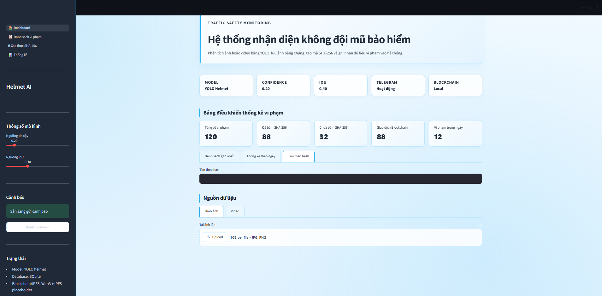

# 🌆 HỆ THỐNG GIÁM SÁT GIAO THÔNG THÔNG MINH: PHÁT HIỆN VI PHẠM KHÔNG ĐỘI MŨ BẢO HIỂM

<div align="center">

**TRƯỜNG ĐẠI HỌC ĐẠI NAM**
**KHOA CÔNG NGHỆ THÔNG TIN**
**AIoTLab - Faculty of Information Technology**

---

### 🚦 Giải pháp quản lý đô thị thông minh ứng dụng AI và Hệ thống cảnh báo tự động qua Telegram

<p align="center">
    <strong>Hệ thống là một phân hệ cốt lõi trong hạ tầng Thành phố thông minh (Smart City), sử dụng mô hình AI YOLOv8 để tự động giám sát, phát hiện các trường hợp người điều khiển xe máy không đội mũ bảo hiểm từ camera giao thông. Dữ liệu vi phạm sau đó được lưu trữ tập trung, hiển thị trực quan trên Web Dashboard và ngay lập tức gửi thông báo cảnh báo kèm hình ảnh bằng chứng về kênh Telegram của lực lượng chức năng theo thời gian thực.</strong>
</p>


</div>

---

## 📝 Giới thiệu dự án

Trong lộ trình xây dựng Thành phố thông minh, việc đảm bảo an toàn giao thông và tự động hóa quy trình giám sát là vô cùng cấp thiết. Dự án tập trung giải quyết bài toán tự động phát hiện hành vi vi phạm không đội mũ bảo hiểm kết hợp cảnh báo tức thời với các mục tiêu chính:

* **Giám sát tự động 24/7:** Thay thế phương pháp tuần tra truyền thống bằng hệ thống camera AI tự động quét và phân tích luồng giao thông liên tục.
* **Trích xuất bằng chứng số:** Tự động chụp ảnh vi phạm, khoanh vùng đối tượng (xe máy, người lái, đầu không có mũ) và ghi nhận chính xác thời gian, vị trí vi phạm.
* **Cảnh báo tức thời qua Telegram:** Ngay khi phát hiện vi phạm, hệ thống sử dụng Telegram Bot API để tự động gửi thông tin chi tiết kèm hình ảnh bằng chứng trực tiếp về nhóm chat điều hành của lực lượng chức năng.
* **Dashboard điều hành trực quan:** Cung cấp giao diện trung tâm cho cơ quan quản lý đô thị theo dõi thống kê số ca vi phạm theo ngày/giờ/tuyến đường.

---

## 🏗️ Sơ đồ khối hệ thống

Luồng xử lý dữ liệu của hệ thống được tối ưu hóa theo mô hình thu thập, xử lý tập trung và phân phối hiển thị kết hợp báo động:

```text
                                                 ┌──> [ Cơ Sở Dữ Liệu SQLite ] ──> [ Dashboard Streamlit ]
[ Camera Giám Sát ] ──> ( Xử lý AI: YOLOv8 ) ──┤
                                                 └──> ( Module Telegram Bot )   ──> [ 📱 Tin nhắn thông báo khẩn cấp ]

```

---

## ✨ Tính năng chính của các phân hệ

| Phân hệ chức năng | Mô tả chi tiết kỹ thuật |
| --- | --- |
| **🧠 Trí tuệ nhân tạo (AI & Computer Vision)** | Tích hợp mô hình **YOLOv8** nhận diện cấu trúc: Xe máy $\rightarrow$ Người điều khiển $\rightarrow$ Trạng thái đầu (Có/Không đội mũ).Thuật toán xử lý ảnh **OpenCV** giúp bóc tách và tự động cắt (Crop) khung ảnh bằng chứng vi phạm đạt độ nét cao. |
| **📊 Cơ sở dữ liệu (Local Storage)** | Sử dụng cơ sở dữ liệu **SQLite** để tổ chức lưu trữ thông tin vi phạm khoa học.Quản lý thông tin bao gồm: ID vi phạm, thời gian, tuyến đường/vị trí camera, và đường dẫn ảnh bằng chứng gốc. |
| **🚨 Hệ thống cảnh báo Telegram** | Tích hợp **Telegram Bot API** để tự động hóa quy trình báo động khẩn cấp.Hệ thống gửi tin nhắn bao gồm thông tin chi tiết (Thời gian, Vị trí camera) và **đính kèm trực tiếp file ảnh vi phạm** về thiết bị của người quản lý chỉ sau vài giây. |
| **🖥️ Trung tâm điều hành (Web Dashboard)** | Xây dựng giao diện ứng dụng quản lý bằng framework **Streamlit** trực quan.**Trang Giám sát:** Hiển thị luồng camera AI đang phân tích trực tiếp.**Trang Quản lý:** Danh sách bộ lọc, tìm kiếm lịch sử vi phạm và vẽ biểu đồ thống kê xu hướng vi phạm theo thời gian. |

### 📸 Hình ảnh Demo hệ thống

#### 1. Giao diện điều hành trung tâm (Web Dashboard)


#### 2. Mô hình AI YOLOv8 phát hiện vi phạm


#### 3. Thông báo tự động gửi về Telegram


---

## 🔧 Công nghệ sử dụng

* **Ngôn ngữ lập trình:** Python 3.10+
* **Mô hình nhận diện AI:** YOLOv8 (Ultralytics), OpenCV
* **Hệ thống cảnh báo:** Telegram Bot API (`requests` / `telebot`)
* **Giao diện Dashboard:** Streamlit UI Framework
* **Cơ sở dữ liệu:** SQLite
* **Thư viện phân tích dữ liệu:** Pandas, NumPy, Matplotlib (vẽ biểu đồ thống kê)

---

## 📁 Cấu trúc thư mục mã nguồn

```text
smartcity-helmet-detection/
│
├── ai_modules/             # Module xử lý camera và nhận diện AI
│   ├── weights/            # Chứa file huấn luyện (.pt) của YOLOv8
│   ├── helmet_detector.py  # Script chính chạy mô hình phát hiện vi phạm
│   └── vision_utils.py     # Hàm bổ trợ cắt ảnh bằng chứng, vẽ khung bounding box
│
├── notify_modules/         # Module xử lý cảnh báo và thông báo
│   └── telegram_bot.py     # Script cấu hình Bot Token, gửi text và hình ảnh vi phạm qua Telegram
│
├── app/                    # Trung tâm điều hành Web Dashboard (Streamlit)
│   ├── main_app.py         # File khởi chạy ứng dụng chính
│   └── pages/              # Các trang chức năng (Giám sát live, Lịch sử phạt nguội, Thống kê)
│
├── database/               # Quản lý lưu trữ cơ sở dữ liệu cục bộ
│   ├── db_manager.py       # Script kết nối và thực thi các câu lệnh SQL (Insert, Select)
│   └── violations.db       # File lưu trữ dữ liệu SQLite
│
├── data/                   # Thư mục lưu trữ hình ảnh
│   └── evidence_images/    # Nơi lưu các bức ảnh bằng chứng vi phạm bị cắt từ camera
│
├── requirements.txt        # Các thư viện Python cần cài đặt (`pip install -r requirements.txt`)
└── README.md

```

---

## 📌 Hướng phát triển tương lai trong hệ sinh thái Smart City

* [ ] Tích hợp thêm module nhận diện biển số xe (ANPR) tự động từ vùng ảnh vi phạm để truy xuất thông tin chủ phương tiện, gửi kèm biên bản phạt nguội trực tiếp qua Telegram.
* [ ] Kết nối hệ thống với bản đồ số GIS của thành phố để định vị trực quan vị trí các camera có tỷ lệ vi phạm cao.
* [ ] Tối ưu hóa mô hình AI để có thể đóng gói triển khai trực tiếp lên các thiết bị phần cứng Edge AI nhỏ gọn (như Jetson Nano) đặt ngay tại cột đèn giao thông.

```

