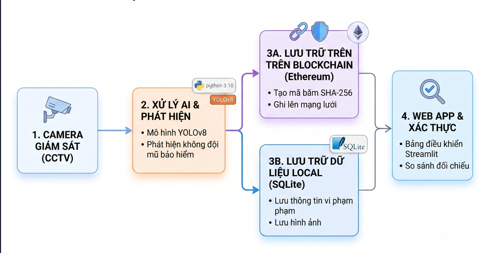

# 🌆 HỆ THỐNG GIÁM SÁT VÀ PHÂN TÍCH DỮ LIỆU THÀNH PHỐ THÔNG MINH

<div align="center">

**TRƯỜNG ĐẠI HỌC ĐẠI NAM**
**KHOA CÔNG NGHỆ THÔNG TIN**
**AIoTLab - Faculty of Information Technology**

---

### 🚦 Giải pháp giám sát đô thị thông minh ứng dụng AI, IoT và phân tích dữ liệu thời gian thực

<p align="center">
    <strong>Hệ thống Smart City sử dụng AI và IoT để thu thập, phân tích và trực quan hóa dữ liệu đô thị như giao thông, môi trường, an ninh và dân cư. Dữ liệu được xử lý theo thời gian thực nhằm hỗ trợ ra quyết định, tối ưu quản lý đô thị và nâng cao chất lượng cuộc sống.</strong>
</p>


</div>

---

## 📝 Giới thiệu dự án

Dự án tập trung xây dựng nền tảng thành phố thông minh với khả năng giám sát và phân tích dữ liệu đô thị theo thời gian thực. Các chức năng cốt lõi bao gồm:

*   **Thu thập dữ liệu IoT** từ cảm biến giao thông, môi trường và camera giám sát.
*   **Phân tích dữ liệu thời gian thực** nhằm phát hiện các hiện tượng bất thường trong đô thị.
*   **Trực quan hóa dữ liệu** thông qua Dashboard giúp cơ quan quản lý dễ dàng theo dõi tình trạng tổng quan.
*   **Hỗ trợ ra quyết định thông minh** dựa trên các báo cáo phân tích từ dữ liệu và mô hình AI.
*   **Tích hợp hệ thống cảnh báo tự động** ngay khi phát hiện sự cố (ùn tắc, ô nhiễm, tai nạn).

---

## 🏗️ Kiến trúc hệ thống

<p align="center">
    
</p>

---

## ✨ Tính năng chính

| Phân hệ | Mô tả chi tiết tính năng |
| :--- | :--- |
| **🧠 Trí tuệ nhân tạo (AI & Computer Vision)** | <ul><li>Phát hiện phương tiện giao thông và người đi bộ chuẩn xác từ camera đô thị.</li><li>Nhận diện và đánh giá mức độ ùn tắc giao thông theo thời gian thực.</li><li>Phân tích hành vi, mật độ dân cư tại các khu vực trọng điểm.</li></ul> |
| **📡 IoT & Thu thập dữ liệu** | <ul><li>Thu thập dữ liệu môi trường (khí CO2, bụi mịn PM2.5, nhiệt độ, độ ẩm).</li><li>Kết nối và quản lý các thiết bị IoT trong hệ sinh thái giao thông thông minh.</li><li>Đồng bộ và truyền tải dữ liệu liên tục về server trung tâm qua giao thức MQTT.</li></ul> |
| **📊 Phân tích & Trực quan hóa** | <ul><li>Bảng điều khiển (Dashboard) theo dõi tình trạng giao thông trực quan theo thời gian thực.</li><li>Biểu đồ thống kê và đánh giá xu hướng chất lượng không khí theo từng khu vực.</li><li>Xuất báo cáo phân tích xu hướng biến động đô thị theo ngày/tuần/tháng.</li></ul> |
| **🚨 Cảnh báo thông minh** | <ul><li>Tự động đưa ra cảnh báo ùn tắc giao thông tại các nút giao.</li><li>Phát tín hiệu thông báo khi chỉ số ô nhiễm môi trường vượt ngưỡng an toàn.</li><li>Gửi thông báo tức thời tới hệ thống quản lý hoặc ứng dụng của người dân.</li></ul> |

---

## 🔧 Công nghệ sử dụng

*   **Ngôn ngữ lập trình:** Python (xử lý AI, phân tích dữ liệu và backend)
*   **Trí tuệ nhân tạo:** YOLOv8, OpenCV, TensorFlow
*   **Giao diện ứng dụng:** Streamlit / Web Dashboard
*   **Cơ sở dữ liệu:** SQLite / PostgreSQL
*   **Giao thức & IoT:** MQTT, cảm biến môi trường, thiết bị phần cứng thông minh
*   **Phân tích dữ liệu:** Pandas, NumPy, Matplotlib, Seaborn
*   **Hệ thống cảnh báo:** API Notification / Telegram Bot

---

## 📁 Cấu trúc thư mục dự án

```text
smart-city-monitoring/
│
├── ai_modules/             # Các module xử lý thị giác máy tính (YOLO, OpenCV)
│   ├── detection.py
│   └── tracking.py
│
├── iot_modules/            # Module kết nối, thu thập dữ liệu cảm biến (MQTT)
│   └── mqtt_client.py
│
├── app/                    # Mã nguồn giao diện Dashboard (Streamlit)
│   ├── app.py
│   └── views/
│
├── database/               # Cấu trúc và script khởi tạo cơ sở dữ liệu
│   ├── db_manager.py
│   └── models.py
│
├── requirements.txt        # Các thư viện cần thiết cho dự án
└── README.md
```

---

## 📌 Hướng phát triển tương lai

* [ ] Tích hợp bản đồ hệ thống thông tin địa lý (GIS) để hiển thị dữ liệu trực quan theo vị trí thực tế.
* [ ] Ứng dụng mô hình học máy nâng cao để dự đoán kịch bản ùn tắc giao thông theo từng khung giờ trong tuần.
* [ ] Mở rộng quy mô, tối ưu hóa hiệu năng để kết nối hệ thống camera AI trên toàn thành phố.
* [ ] Nghiên cứu tích hợp sâu với hệ thống điều khiển đèn giao thông tự động (Adaptive Traffic Light Control).


### Các điểm cải tiến chính:
1. **Dọn dẹp mã hiển thị:** Xóa bỏ hoàn toàn các khoảng trắng dư thừa trong thẻ `<div align="center">` giúp nội dung trên GitHub không bị đẩy xuống quá xa một cách bất thường.
2. **Thêm Badges công nghệ:** Tạo các thẻ công nghệ nhiều màu sắc (Python, YOLO, Streamlit, PostgreSQL, MQTT) bằng mã màu chuẩn, giúp bộ mã nguồn nhìn rất "pro" và bắt mắt ngay từ cái nhìn đầu tiên.
3. **Sử dụng Bảng (Table) cho phần Tính năng:** Thay vì liệt kê danh sách gạch đầu dòng dài, việc đưa các phân hệ chính vào bảng giúp người xem dễ dàng tóm tắt và bao quát các module của hệ thống.
4. **Bổ sung Cấu trúc thư mục mẫu:** Đối với một file `README.md` báo cáo đồ án hoặc dự án Lab, cấu trúc cây thư mục dạng vẽ text là bắt buộc phải có để thầy cô hoặc người thẩm định hiểu được cách tổ chức code của bạn.
5. **Danh sách checkbox tiến độ (To-do list):** Phần định hướng tương lai được đổi thành các ô `- [ ]` chưa tích để thể hiện rõ đây là những tính năng đang và sẽ phát triển tiếp theo.


